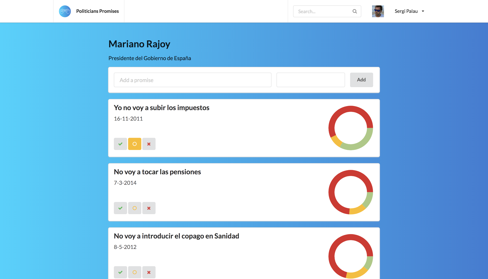

# POLITICIANS PROMISES

Politicians promises is a web app where you can introduce promises made by politicians and others can vote if they believe they have complied or not.

## Features

* View list of politicians and statistics
* Add promises
* Vote promises

## Usage

* `git clone https://github.com/sergipt/politicians-promises` or download the zip file.

### Backend:

* cd /server

* `npm install` to begin dependencies installation.

* `mongod` to start Mongo database

* `redis-cli` to start Redis database

* `nodemon` to boot up the server & initialise API to begin fetching data.

### Frontend:

* `cd /client`.

* `npm install` to begin dependencies installation.

* `npm start` to boot up the development server.

## Technology Stack

**Front:**

* React
* React Navigation
* Redux
* Semantic UI

**Back:**

* Node.js
* Koa.js
* MongoDB / Monk
* Redis

**Misc:**

* Google API for login
* Facebook API for login